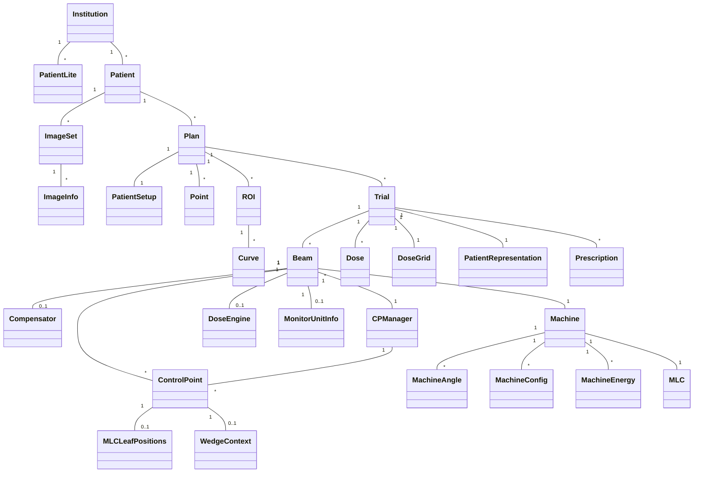

# Pinnacle Data Models

## SQLAlchemy Model Standards

This section documents the coding standards and patterns used for SQLAlchemy models in the Pinnacle I/O system.

### 1. Relationship Patterns

IMPORTANT: All collection relationships MUST use the `_list` suffix (e.g., `patient_list`, `beam_list`).
This is a strict requirement for consistency across the codebase.

#### One-to-Many Relationships
```python
# Parent side
child_list: Mapped[list["Child"]] = relationship(
    "Child", 
    back_populates="parent",
    cascade="all, delete-orphan",  # For composition relationships
    lazy="selectin"  # For better performance with collections
)

# Child side
parent_id: Mapped[int] = Column("ParentID", Integer, ForeignKey("Parent.ID"))
parent: Mapped["Parent"] = relationship("Parent", back_populates="child_list")
```

#### Many-to-One Relationships
```python
# Child side (same as above)
parent_id: Mapped[int] = Column("ParentID", Integer, ForeignKey("Parent.ID"))
parent: Mapped["Parent"] = relationship("Parent", back_populates="child_list")

# Parent side
child_list: Mapped[list["Child"]] = relationship(
    "Child", 
    back_populates="parent"
)
```

#### One-to-One Relationships
```python
# Primary side
child: Mapped["Child"] = relationship(
    "Child",
    back_populates="parent",
    uselist=False,
    cascade="all, delete-orphan"
)

# Secondary side
parent_id: Mapped[int] = Column("ParentID", Integer, ForeignKey("Parent.ID"))
parent: Mapped["Parent"] = relationship("Parent", back_populates="child")
```

### Relationship Naming Convention - MANDATORY

1. **Collection relationships** (one-to-many, many-to-many) MUST use the `_list` suffix:
   - ✅ CORRECT: `patient_list`, `beam_list`, `roi_list`, `trial_list`
   - ❌ INCORRECT: `patients`, `beams`, `rois`, `trials`

2. **Single relationships** (many-to-one, one-to-one) should use the singular form without any suffix:
   - ✅ CORRECT: `patient`, `plan`, `institution`
   - ❌ INCORRECT: `patient_item`, `plan_ref`, `institution_obj`

3. **Back-populates must match exactly** - if one side uses `_list`, the other side must reference it exactly the same way.

4. **This is not optional** - All new code must follow this convention, and existing code should be updated to match when modified.
```

### 2. Method Documentation Standards

#### `__init__` Method
```python
def __init__(self, **kwargs):
    """Initialize a [ModelName] instance.

    Args:
        **kwargs: Keyword arguments for model attributes.

    Relationships:
        relationship_name (Type): Description of the relationship.
    """
    super().__init__(**kwargs)
```

#### `__repr__` Method
```python
def __repr__(self) -> str:
    """Return string representation of the model instance.
    
    Returns:
        str: A string containing the class name and primary key.
    """
    return f"<{self.__class__.__name__}(id={self.id}, name='{self.name}')>"
```

#### Property Getters/Setters
```python
@property
def full_name(self) -> str:
    """Get the full name by combining name components.
    
    Returns:
        str: Combined name components.
    """
    return f"{self.first_name} {self.last_name}"

@full_name.setter
def full_name(self, value: str) -> None:
    """Set first and last name from full name.
    
    Args:
        value: Full name to parse.
    """
    parts = value.split(' ', 1)
    self.first_name = parts[0]
    self.last_name = parts[1] if len(parts) > 1 else ''
```

### 3. Type Hinting Standards

- Use SQLAlchemy 2.0 style type hints with `Mapped[Type]`
- Be specific with collection types (e.g., `list["Child"]` instead of just `list`)
- Use `Optional[Type]` for nullable fields
- Use `list[Type]` for collections instead of `List[Type]` (Python 3.9+ style)

### 4. Cascade Behavior

- Use `cascade="all, delete-orphan"` for composition relationships
- Use `cascade="save-update, merge"` for aggregation relationships
- Be explicit about cascade behavior in the relationship documentation

### 5. Lazy Loading Strategy

- Default: `lazy="select"` (lazy loading)
- For collections that are always needed: `lazy="selectin"`
- For performance-critical relationships: `lazy="joined"`

### 6. Naming Conventions - IMPORTANT

- **Table names**: PascalCase (e.g., `Patient`, `TreatmentPlan`)
- **Column names**: Match database schema (PascalCase)
- **Relationship names**: 
  - Use snake_case
  - **CRITICAL**: Collection relationships MUST use the `_list` suffix (e.g., `patient_list`, `beam_list`, `roi_list`, `trial_list`)
  - This is a strict requirement for consistency across the codebase
  - Never use pluralized nouns (e.g., 'patients', 'beams') for relationship names
  - Never use other suffixes like 'collection' or 'items' - always use `_list`

### 7. Base Model Standards

All models should inherit from `PinnacleBase` or `VersionedBase` which provides:
- Common fields (`id`, `created_at`, `updated_at`)
- Basic CRUD operations
- Serialization methods

## Model Hierarchy

This diagram shows the parent-child relationships between models in the Pinnacle I/O system:



## Model Implementation Status

### Core Models Overview

1. **Patient**
   - **Purpose**: Central entity containing patient information and treatment data
   - **Key Fields**: Medical record number, name, date of birth, physicians
   - **Relationships**:
     - Belongs to Institution (many-to-one)
     - Has many ImageSets (one-to-many)
     - Has many Plans (one-to-many)

2. **Plan**
   - **Purpose**: Container for treatment configuration and trials
   - **Key Fields**: Plan name, status, version information
   - **Relationships**:
     - Belongs to Patient (many-to-one)
     - Has one PatientSetup (one-to-one)
     - Has many Points (one-to-many)
     - Has many ROIs (one-to-many)
     - Has many Trials (one-to-many)

3. **Trial**
   - **Purpose**: Specific treatment configuration within a plan
   - **Key Fields**: Trial name, dose calculations, machine parameters
   - **Relationships**:
     - Belongs to Plan (many-to-one)
     - Has many Beams (one-to-many)
     - Has many Doses (one-to-many)
     - Has one DoseGrid (one-to-one)
     - Has one PatientRepresentation (one-to-one)

4. **Beam**
   - **Purpose**: Individual treatment beam configuration
   - **Key Fields**: Beam type, energy, MLC configuration, monitor units
   - **Relationships**:
     - Belongs to Trial (many-to-one)
     - Has many ControlPoints (one-to-many)
     - Has one Compensator (one-to-one)
     - Has one CPManager (one-to-one)

### Detailed Model Relationships

```
Institution
├── patient_lite_list: List[PatientLite]
└── patients: List[Patient]
    ├── image_sets: List[ImageSet]
    │   └── image_info_list: List[ImageInfo]
    └── plans: List[Plan]
        ├── patient_position: PatientSetup
        ├── points: List[Point]
        ├── rois: List[ROI]
        │   └── curves: List[Curve]
        └── trials: List[Trial]
            ├── beams: List[Beam]
            │   ├── compensator: Optional[Compensator]
            │   ├── control_points: List[ControlPoint]
            │   │   ├── mlc_leaf_positions: Optional[MLCLeafPositions]
            │   │   └── wedge_context: Optional[WedgeContext]
            │   ├── cp_manager: CPManager
            │   │   └── control_points: List[ControlPoint]
            │   ├── dose: Optional[Dose]
            │   ├── dose_engine: Optional[DoseEngine]
            │   └── monitor_unit_info: Optional[MonitorUnitInfo]
            ├── dose: Optional[Dose]
            ├── dose_grid: DoseGrid
            │   └── doses: List[Dose]
            ├── max_dose_point: Optional[MaxDosePoint]
            ├── patient_representation: Optional[PatientRepresentation]
            └── prescriptions: List[Prescription]
```

## Implementation Standards

### File Structure

The Pinnacle I/O models are organized into the following files:

- `pinnacle_base.py`: Contains the base `PinnacleBase` class that all models inherit from.
- `versioned_base.py`: Contains the `VersionedBase` class that adds version tracking capabilities.
- `types.py`: Contains custom SQLAlchemy types and utility classes used across models.
- Model-specific files: Individual model classes are organized into separate files by domain.

### Base Classes

1. **PinnacleBase**
   - Abstract base class for all models
   - Provides common fields: `id`, `created_at`, `updated_at`
   - Implements utility methods for field mapping and normalization

2. **VersionedBase** (extends PinnacleBase)
   - Adds version tracking capabilities
   - Includes fields: `write_version`, `create_version`, `login_name`
   - Tracks creation and modification timestamps

### Custom Types

The following custom types are available in `pinnacle_io.models.types`:

#### `JsonList`

A SQLAlchemy type for storing Python lists as JSON strings in the database.

```python
from pinnacle_io.models.types import JsonList

class ExampleModel(PinnacleBase):
    __tablename__ = 'examples'
    
    id = Column(Integer, primary_key=True)
    tags = Column(JsonList)  # Will be stored as JSON string
```

#### Spatial Types

The following spatial types are available for representing different kinds of spatial data:

1. **`VoxelSize`** - Represents the size of voxels in 3D space (in mm)
   ```python
   from pinnacle_io.models.types import VoxelSize
   
   # Create with x, y, z dimensions in mm
   voxel_size = VoxelSize(1.0, 1.0, 2.0)
   print(voxel_size.volume())  # Calculate volume in mm³
   ```

2. **`Dimension`** - Represents discrete dimensions (e.g., number of voxels)
   ```python
   from pinnacle_io.models.types import Dimension
   
   # Create with x, y, z dimensions
   dim = Dimension(100, 100, 50)
   print(dim.num_voxels())  # Calculate total number of voxels
   ```

3. **`Coordinate`** - Represents a 3D point in space (in mm)
   ```python
   from pinnacle_io.models.types import Coordinate
   
   # Create a coordinate
   point = Coordinate(10.0, 20.0, 30.0)
   origin = Coordinate.origin()  # (0, 0, 0)
   
   # Calculate distance between points
   distance = point.distance_to(origin)
   
   # Vector operations
   moved = point + Coordinate(1, 1, 1)  # (11.0, 21.0, 31.0)
   scaled = point * 2  # (20.0, 40.0, 60.0)
   ```

4. **`Index`** - Represents a discrete 3D index (e.g., array indices)
   ```python
   from pinnacle_io.models.types import Index
   
   # Create an index
   idx = Index(1, 2, 3)
   ```

5. **`ContinuousIndex`** - Represents a continuous 3D index (e.g., sub-voxel positions)
   ```python
   from pinnacle_io.models.types import ContinuousIndex
   
   # Create a continuous index
   cidx = ContinuousIndex(1.5, 2.3, 3.7)
   ```

6. **`VolumeSize`** - Represents the physical size of a volume (in mm)
   ```python
   from pinnacle_io.models.types import VolumeSize
   
   # Create a volume size
   vol_size = VolumeSize(200.0, 200.0, 150.0)
   print(vol_size.volume())  # Calculate volume in mm³
   ```

### Code Style

- **Field Naming**:
  - Python fields: `snake_case`
  - Database columns: `PascalCase` (matching Pinnacle's conventions)
  - Relationships: Use the *_list format (e.g., `beam_list` not `beams`)

- **Field Definitions**:
  ```python
  # Basic field with type hint and column definition
  name: Mapped[str] = Column("Name", String, nullable=True)
  
  # Required field (non-nullable)
  patient_id: Mapped[int] = Column("PatientID", Integer, nullable=False)
  
  # Relationship with back_populates for bidirectional navigation
  patient: Mapped["Patient"] = relationship("Patient", back_populates="plans")
  ```

- **Model Structure**:
  1. Table name definition
  2. Field definitions (nullable)
  3. Parent relationship(s)
  4. Child relationship(s)
  5. Special methods (`__init__`, `__repr__`)
  6. Class-specific properties, if applicable
  7. Class-specific methods, if applicable

### Relationship Patterns

```python
# One-to-Many (Parent side)
class Parent(PinnacleBase):
    children: Mapped[list["Child"]] = relationship(
        "Child", 
        back_populates="parent",
        cascade="all, delete-orphan"
    )

# Many-to-One (Child side)
class Child(PinnacleBase):
    parent_id: Mapped[int] = Column("ParentID", Integer, ForeignKey("Parent.ID"))
    parent: Mapped["Parent"] = relationship("Parent", back_populates="children")

# One-to-One
class Configuration(PinnacleBase):
    user_id: Mapped[int] = Column("UserID", Integer, ForeignKey("User.ID"), unique=True)
    user: Mapped["User"] = relationship("User", back_populates="config")
```

### Model Methods

1. **`__init__`**
   - Should accept `**kwargs` for all fields and relationships
   - Handle both Python field names and database column names
   - Initialize related objects if provided

2. **`__repr__`**
   - Include only the most essential identifying information (e.g., id, name)

## Special Considerations

### Control Points

Control points define the dynamic aspects of radiation delivery:

- **Storage**:
  - Primary storage in Pinnacle: `Beam -> CPManager -> ControlPoints`
  - Direct association with `Beam` for convenience
  - Each control point contains MLC positions, gantry angle, and monitor units

- **Implementation Notes**:
  - Verify relationship between `Beam` and `CPManager` is properly maintained
  - Ensure control points are properly ordered (typically by MU or angle)
  - Handle both static and dynamic treatment techniques

### Dose Management

- **Dose Grid**:
  - Each trial specifies its own 3D dose grid
  - Grid resolution and dimensions are trial-specific
  - Stored in `DoseGrid` model

- **Dose Calculation**:
  - Beam-specific doses reference the trial's dose grid
  - Trial dose is the sum of all beam doses
  - DICOM export requires proper dose grid handling

- **Implementation Status**:
  - Composite plan doses (sum of trial doses) are not currently implemented
  - Rationale: May involve different dose grids with varying resolutions
  - Recommendation: Create composite plans as separate trials when needed

## Model Specification

### General Guidelines

- All models inherit from PinnacleBase or, for versioned data, from VersionedPinnacleBase
- Model fields should be snake_case per Python conventions
- Database table and column names should be PascalCase
- Define model parent relationship(s) after model field definitions using comment: # Parent relationship(s)
- Define model child relationship(s) after parent relationship definitions using comment: # Child relationship(s)
- The model constructor (__init__) method should be used to create related objects after initialization if provided
- The model constructor should also support kwargs as either the model field name (e.g., patient_id) or database column name (e.g., PatientID)

### DoseGrid Model

The `DoseGrid` model represents the 3D grid structure used for dose calculations in a treatment plan. It defines the spatial characteristics of the dose calculation volume.

**Database Table**: `DoseGrid`

**Fields**:
- `id` (Integer, Primary Key): Unique identifier
- `voxel_size_x`, `voxel_size_y`, `voxel_size_z` (Float): Voxel dimensions in mm
- `dimension_x`, `dimension_y`, `dimension_z` (Integer): Grid dimensions in voxels
- `origin_x`, `origin_y`, `origin_z` (Float): Origin coordinates in mm (DICOM patient coordinates)
- `vol_rot_delta_x`, `vol_rot_delta_y`, `vol_rot_delta_z` (Float): Volume rotation deltas
- `display_2d` (Integer): Flag for 2D display (0 or 1)
- `dose_summation_type` (Integer): Type of dose summation
- `trial_id` (Integer, Foreign Key): Reference to parent Trial

**Properties**:
- `voxel_size` (VoxelSize): Get/set voxel dimensions as a VoxelSize object
- `dimension` (Dimension): Get/set grid dimensions as a Dimension object
- `origin` (Coordinate): Get/set origin as a Coordinate object
- `vol_rot_delta` (Coordinate): Get/set rotation deltas as a Coordinate object
- `physical_size` (VolumeSize): Calculate the physical size of the dose grid in mm
- `num_voxels` (int): Calculate the total number of voxels in the grid

**Relationships**:
- `trial` (many-to-one): Reference to the parent Trial
- `doses` (one-to-many): List of Dose objects associated with this grid

**Example Usage**:
```python
# Create a new dose grid
dose_grid = DoseGrid(
    voxel_size=VoxelSize(0.3, 0.3, 0.3),  # 3mm isotropic voxels
    dimension=Dimension(100, 100, 50),     # 100x100x50 voxel grid
    origin=Coordinate(-150.0, -150.0, -75.0),  # Center at (-150, -150, -75) mm
    display_2d=1,
    dose_summation_type=1
)

# Access properties
print(f"Voxel volume: {dose_grid.voxel_size.volume()} mm³")
print(f"Grid dimensions: {dose_grid.dimension.num_voxels()} voxels")
print(f"Physical size: {dose_grid.physical_size().x}x{dose_grid.physical_size().y}x{dose_grid.physical_size().z} mm")

# Convert to dictionary (e.g., for serialization)
grid_dict = {
    'voxel_size': dose_grid.voxel_size.to_dict(),
    'dimension': dose_grid.dimension.to_dict(),
    'origin': dose_grid.origin.to_dict(),
    'vol_rot_delta': dose_grid.vol_rot_delta.to_dict() if dose_grid.vol_rot_delta else None
}
```

**Implementation Notes**:
- The model maintains backward compatibility by accepting both the new spatial types and dictionary/object inputs
- All spatial properties return the appropriate spatial type objects for type safety and convenience
- The model enforces validation rules (e.g., positive dimensions, non-negative voxel sizes)
- The physical coordinates follow the DICOM patient coordinate system (LPS convention)

## Pending Implementation
- Add cascade="all, delete-orphan" to all relationships
- Make sure the "___init__" method has input arguments to specify model relationships
- Remove the patient_setup from the trial model. It belongs to the plan. Access using trial.plan.patient_position